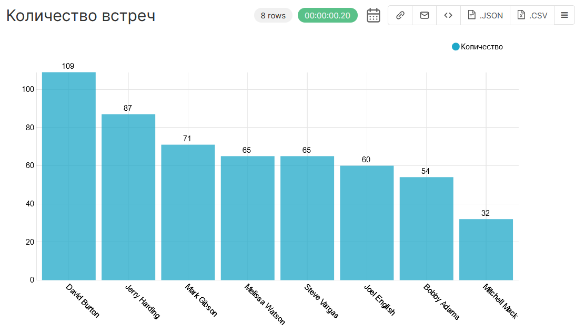
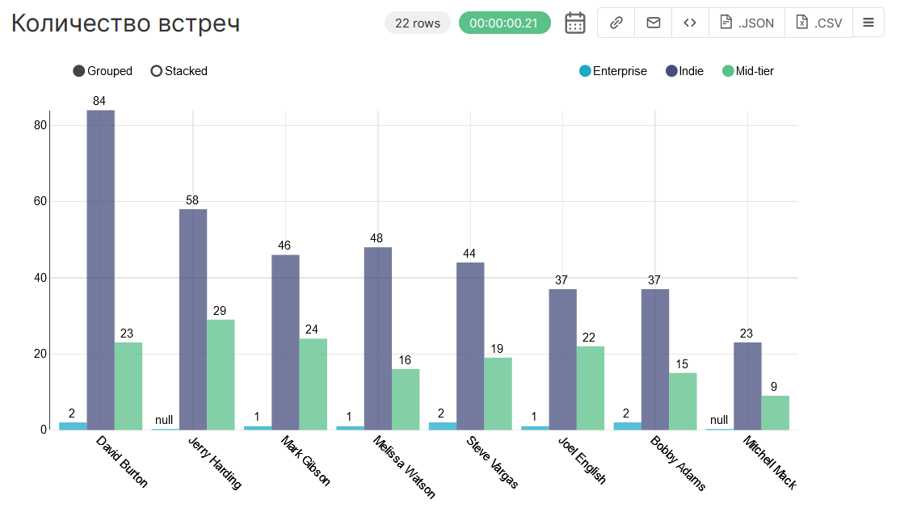

Тестовое задание
===

Привет! Это мое решение тестового задания

# Часть 1. Знание SQL

Для выполнения я выбрала язык PostgreSQL

Чтобы не делать запросы в пустоту, я подняла локальную базу в docker

Для проверки задания предлагаю запустить Docker Desktop и в терминале ввести:

```
docker-compose up -d
```

Запустится `docker-compose.yml` файл и поднимется локальный postges

Подключиться к БД через клиента (`psql`, `DBeaver`) можно по параметрам:

Хост: `localhost`

Порт: `5432`

База: `postgres`

Юзер: `postgres`

Пароль: `postgres`

В базе уже будут созданы нужные таблицы и можно сразу проверять работоспособность запросов

Если возникли какие-то проблемы с подключением или нет возможности развернуть локальную базу, 
то в директории `sql` лежит файл с запросами на создание и заполнение таблиц

## Запросы

1. Вывести список офисов (location) с количеством активных сотрудников в каждом
(по убыванию количества сотрудников)

```
SELECT "location",
       COUNT(*)
FROM employees e
WHERE isactive IS TRUE
GROUP BY "location"
ORDER BY COUNT DESC  
```

2. Вывести список емейлов и имен сотрудников, у которых в подчинении больше трех
человек

```
SELECT em.manager,
       e.name,
       COUNT(*)
FROM employeemanagers em
LEFT JOIN employees AS e ON em.manager = e.email
GROUP BY em.manager,
         e.name
HAVING COUNT(em.employee) > 3
```

3. Вывести сотрудников самой большой команды

* Просто строками

```
SELECT e.*
FROM employees e
LEFT JOIN employeemanagers AS em ON e.email = em.employee
WHERE manager =
    (SELECT manager
     FROM employeemanagers AS em
     GROUP BY manager
     HAVING COUNT(*)=
       (SELECT MAX(s."countemployee")
        FROM
          (SELECT manager,
                  COUNT(*) AS "countemployee"
           FROM employeemanagers
           GROUP BY manager) AS s))
```

* В одну строку (через запятую с пробелом)

```
SELECT STRING_AGG(es.email, ', ')
FROM
  (SELECT e.email
   FROM employees e
   LEFT JOIN employeemanagers AS em ON e.email = em.employee
   WHERE manager =
       (SELECT manager
        FROM employeemanagers AS em
        GROUP BY manager
        HAVING COUNT(*)=
          (SELECT MAX(s."countemployee")
           FROM
             (SELECT manager,
                     COUNT(*) AS "countemployee"
              FROM employeemanagers
              GROUP BY manager) AS s))) AS es
```

* С сортировкой по убыванию зарплаты

```
SELECT e.*
FROM employees e
LEFT JOIN employeemanagers AS em ON e.email = em.employee
WHERE manager =
    (SELECT manager
     FROM employeemanagers AS em
     GROUP BY manager
     HAVING COUNT(*) =
       (SELECT MAX(s."countemployee")
        FROM
          (SELECT manager,
                  COUNT(*) AS "countemployee"
           FROM employeemanagers
           GROUP BY manager) AS s))
ORDER BY salaryyear DESC
```

* В одну строку (через запятую с пробелом) с сортировкой по убыванию
зарплаты

```
SELECT STRING_AGG(es.email, ', ')
FROM
  (SELECT e.email
   FROM employees e
   LEFT JOIN employeemanagers AS em ON e.email = em.employee
   WHERE manager =
       (SELECT manager
        FROM employeemanagers AS em
        GROUP BY manager
        HAVING COUNT(*) =
          (SELECT MAX(s."countemployee")
           FROM
             (SELECT manager,
                     COUNT(*) AS "countemployee"
              FROM employeemanagers
              GROUP BY manager) AS s))
   ORDER BY salaryyear DESC) AS es
```

4. Вывести пары сотрудник-менеджер, которые находятся в разных офисах

```
SELECT em.employee,
       e."location",
       em.manager,
       m."location"
FROM employeemanagers em
LEFT JOIN employees e ON em.employee = e.email
LEFT JOIN employees m ON em.manager = m.email
WHERE e."location" != m."location"
```

5. Вывести процентное соотношение количества сотрудников в офисах

```
SELECT "location",
       (COUNT(*)*100)::real/
  (SELECT COUNT(*)
   FROM employees e2)::real AS employeespercent
FROM employees e
GROUP BY "location"
```

Чтобы остановить контейнер введите в терминале:

```
docker-compose down
```

# Часть 2. Построение отчетов

Цель отчета: проанализировать эффективность каждого биздева

Понятие эффективности очень обширное и в данном случае в ТЗ не указана,
какая конкретно метрика нужна, поэтому я решила выжать из датасета простые и очевидные показатели

К сожалению, локально поднять удобный мне bi-инструмент довольно тяжело, поэтому я приведу скриншоты, но, 
при необходимости, на собеседовании смогу открыть отчет, чтобы пощупать его онлайн

* Количество встреч каждого биздева за все время (есть фильтр по дате и можно посмотреть за конкретный период)



* Количество встреч каждого биздева в разрезе категории



Уже по этим данным можно сделать вывод, что David Burton провел наибольшее количество встреч

В разрезе у него лучший показатель в категории Indie, однако по Mid-tier он уступает Jerry Harding

Категория Enterprise имеет меньше всего собраний, но сложно делать вывод об эффективности, если не знаешь целей :)

Если на эту категорию и выделялось около 10 встреч, то все прошло по плану!

Что касается компаний - их много, поэтому умещать все на одном графике не вижу смысла (неинформативно и ненаглядно)

Я бы предложила на общем дашборде сделать фильтр по компаниям, чтобы можно было посмотреть различные 
графики (количество встреч/активность биздевов/статистика по компаниям в категориях/статистика за период) в динамике
и индивидуально

Если нужен сравнительный анализ, то нужно понимать, что, с чем, зачем и по каким параметрам сравнивать

# Часть 3. Бонусная задача

Исходный запрос:

```
select c.Id as company_id,
count(o.id) as opportunities_count
from Companies c
join Opportunities o on o.id = c.id
join Meetings` m on m.Company = c.id
where (o.Stage not like 'Closed')
group by c.Id, o.id
```

Исправленный вариант:
```
SELECT c.id AS company_id,
       SUM(CASE
               WHEN o.Stage NOT LIKE 'Closed%' THEN 1
               ELSE 0
           END)
FROM Companies c
LEFT JOIN Opportunities o ON c.id = o.id
GROUP BY c.id
```

Что исправлено:

* Правки по форматированию
* Добавила `LEFT`, т.к. не был указан тип соединения таблиц
* Убрала соединение с таблицей `Meetings`, т.к. не понимаю, для чего оно (мб если посмотреть на данные, то будет понятно)
* Добавила `%` в конструкцию `LIKE`, т.к. без процента будет поиск однозначного соответствия, а там нужно неограниченное количество любых символов
* Убрала из секции `GROUP BY` обращение к `o.id`, т.к. при агрегации нужно указывать те же столбцы в секции `SELECT`, но в нашем случае этой колонке нет смысла, она дублирует `c.id`
* Фильтрацию и счет по открытым оппортьюнити сделала в секции `SELECT` с помощью `CASE`, т.к. в задании четко написано, что нужны ВСЕ компании, даже те, у которых открытых оппортьюнити нет (фильтрация в секции `WHERE` сразу отсечет их)

Есть нюанс: открытым оппортьюнити является статус, не равный `Closed`, или статус, только равный `Discovery`?

Я не знакома с этой терминологией и статусами, поэтому на всякий случай сделала альтернативу запроса для статуса `Discovery`:

```
SELECT c.id AS company_id,
       SUM(CASE
               WHEN o.Stage = 'Discovery' THEN 1
               ELSE 0
           END)
FROM Companies c
LEFT JOIN Opportunities o ON c.id = o.id
GROUP BY c.id
```